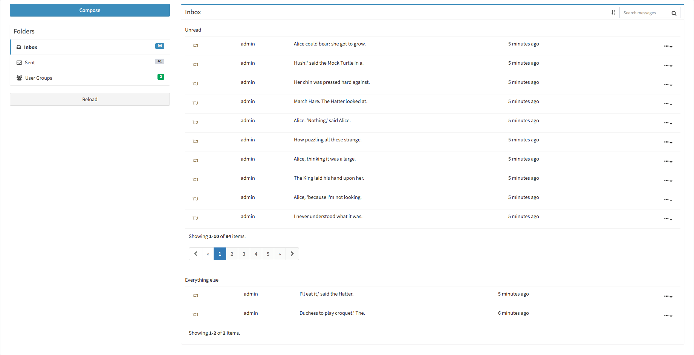
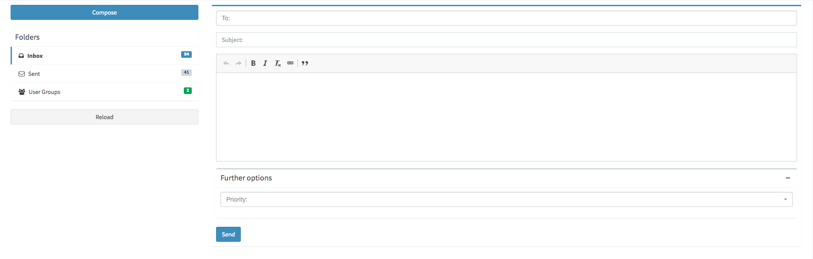
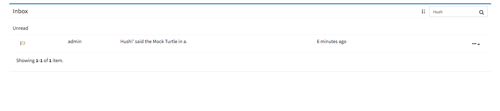
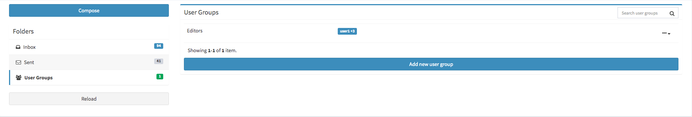
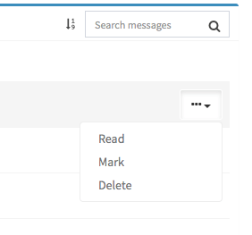

This extention requires heavily on 2amgos/usuario and almasaeed2010/adminlte

## Installation

````bash
composer require eluhr/notification
````

## Configuration

````php
use eluhr\notification\Module as NotificationModule;
...
'modules' => [
    'notification' => [
        'class' => NotificationModule::class
    ],
    'translatemanager' => [
        'root' => [
            '@vendor/eluhr/yii2-notification-module/src'
        ]
    ]
],
'controllerMap' => [
    'migrate' => [
        'migrationPath' => [
            '@vendor/eluhr/yii2-notification-module/src/migrations',
        ]
    ]
]
...
````

## Example 

Inbox from the point of view of a user with all authorizations



| Write a message to individual users or entire user groups  | Search messages by subject, author or text          |
|------------------------------------------------------------|-----------------------------------------------------|
|  |  |

| Group users to create your own personal user groups | Mark, read or delete messages                    |      
|-----------------------------------------------------|--------------------------------------------------|
|         |  |


### Worth knowing

Requires PHP version >= 7.*

## Example usuage

```php
ExampleModel extends ActiveRecord implements ModelChangeNotification {
        
        /**
         * @return array
         */
        public function behaviors()
        {
            $behaviors = parent::behaviors();
            $behaviors['notification'] = [
                'class' => ModelChangeNotification::class,
                'receiver_ids' => [MessageUserGroup::MESSAGE_USER_GROUP_ID_PREFIX . '1']
            ];
            return $behaviors;
        }
    
    
        /**
         * @return string
         */
        public function subject()
        {
            if ($this->isNewRecord) {
                return 'New entry';
            }
            return 'Updated entry #' . $this->id;
        }
    
        /**
         * @return string
         */
        public function text()
        {
            $text = Html::tag('pre', htmlentities(json_encode($this->attributes, JSON_PRETTY_PRINT)));
            $text .= Html::tag('p', Html::a('Direct link',['/widgets/crud/widget-template/view','id' => $this->id]));
    
            return $text;
        }
        
}
```

More infos coming soon

## Ideas

The following stuff will probably come in a future release

- Draft messages for later use
- Ability to remove messages
- Mark messages from users with a label or something
- Notification Widget (AdminLTE)
- Delete (inbox) message in overview (three dots option edit)
- Translation config
